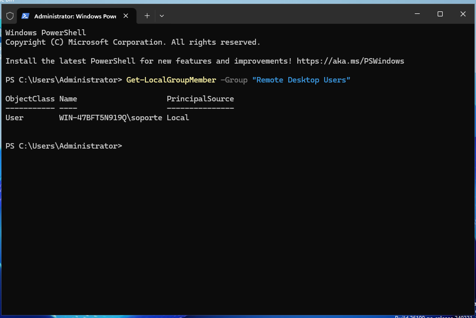
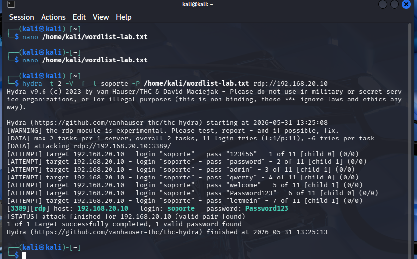
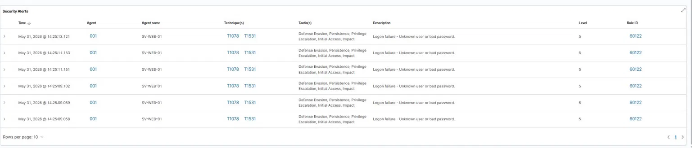
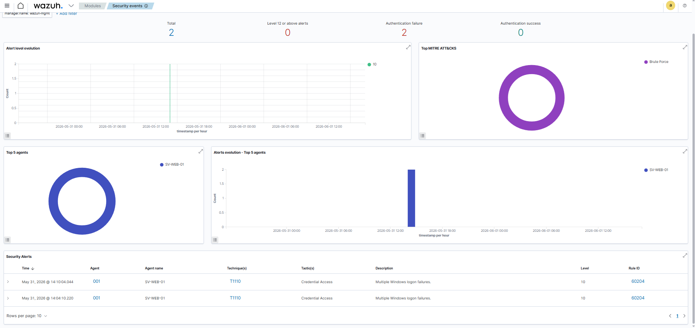
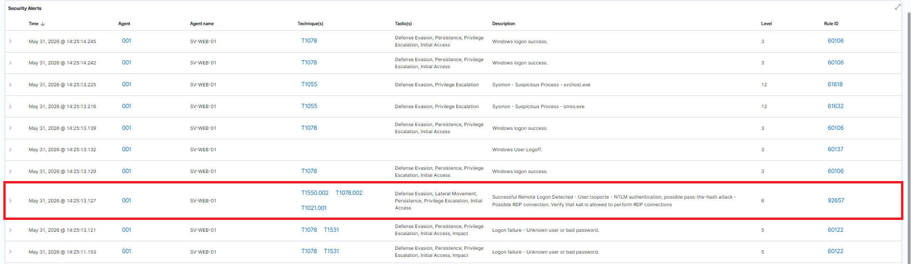
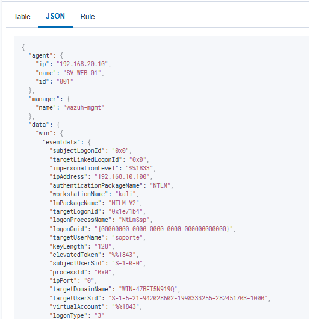
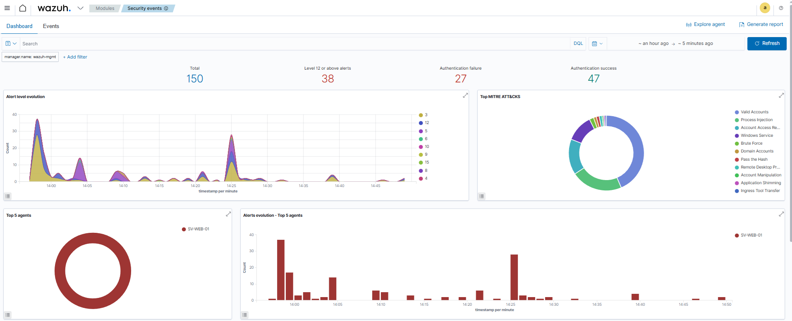

# Brute Force RDP → Acceso Inicial — Análisis de Detección

> Fuerza bruta contra RDP desde Kali, detectada por Wazuh: qué reglas disparan solas y qué gap de correlación queda abierto.

Ataque de fuerza bruta contra el servicio RDP del Windows Server usando Hydra con una wordlist controlada, ejecutado desde la zona ATK (Kali Linux) contra el endpoint en DMZ y analizado desde el SIEM (Wazuh) en la zona MGMT. Wazuh detectó tanto el patrón de brute force como el logon exitoso posterior y los mapeó a MITRE ATT&CK; el análisis también expone un gap secundario: la correlación automática entre *brute force + logon exitoso del mismo usuario* no existe en las reglas default y requiere una regla custom.

Este ataque recorre las zonas del laboratorio de ATK a DMZ; la [arquitectura y las reglas de firewall que lo permiten](https://github.com/thomas-cybersec/Projects/tree/main/home-soc-lab) están documentadas en la base.

---


## Brute Force RDP desde Kali

### Resumen ejecutivo

Ataque de fuerza bruta contra el servicio RDP del Windows Server usando Hydra con una wordlist controlada. **Resultado:** el ataque tuvo éxito en encontrar una credencial válida, y Wazuh detectó tanto el patrón de brute force como el logon exitoso posterior, 
mapeando todo a MITRE ATT&CK automáticamente. Se identifica además un gap secundario: la correlación automática entre brute force + logon exitoso del mismo usuario no existe en las reglas default y requiere una regla custom.

### Mapeo MITRE ATT&CK

| Técnica | Nombre | Táctica |
|---|---|---|
| T1110.001 | Brute Force: Password Guessing | Credential Access |
| T1021.001 | Remote Services: Remote Desktop Protocol | Lateral Movement |
| T1078 | Valid Accounts | Defense Evasion / Persistence / Privilege Escalation / Initial Access |

### Preparación del entorno

**1. Habilitación de RDP en Windows Server:**
- System Properties → Remote → "Allow remote connections to this computer".
- NLA deshabilitado deliberadamente para permitir que Hydra autentique (en producción NLA debe estar habilitado).

**2. Creación de usuario señuelo:**
Creamos un usuario local llamado soporte con contraseña débil (Password123) mediante PowerShell, y lo agregamos al grupo Remote Desktop Users.

**3. Verificación de auditoría de logons:**
### Validación del usuario en grupo RDP


Confirmado: "Logon" con "Success and Failure" habilitado. Sin esto, los Event ID 4625 no se generarían y el ataque sería invisible.


### Ejecución del ataque
**Wordlist usada**:
```
123456
password
admin
qwerty
welcome
letmein
Password123    ← credencial real del usuario
admin123
P@ssw0rd
```

**Comando Hydra para el ataque:**
```bash
hydra -t 2 -V -f -l soporte -P /home/kali/wordlist-lab.txt rdp://192.168.20.10
```

### Salida exitosa de Hydra



**Resultado:**
```
[3389][rdp] host: 192.168.20.10   login: soporte   password: Password123
[STATUS] attack finished for 192.168.20.10 (valid pair found)
1 of 1 target successfully completed, 1 valid password found
```

Hydra encontró la credencial en el intento 8 de 11.


### Análisis en Wazuh

#### Fase 1: detección del brute force

Cascada de alertas individuales y una alerta agregada por correlación.

**Alertas individuales — Rule 60122 (nivel 5):**
- Descripción: *"Logon failure - Unknown user or bad password"*
- Cada una corresponde a un Event ID 4625 de Windows.
- Mapean a T1078 y T1531.

### cascada de logons fallidos



**Alerta agregada — Rule 60204 (nivel 10):**
- Descripción: *"Multiple Windows logon failures"*
- Mapeo MITRE: **T1110 — Brute Force**.
- Táctica: Credential Access.

Esta es la detección clave: Wazuh **correlaciona** múltiples fallos del mismo usuario en una ventana temporal corta y genera una alerta de alto nivel. Es la diferencia entre tener logs y tener un SIEM.

### Alerta de correlación nivel 10 


#### Fase 2: detección del logon exitoso

**Rule 92657 (nivel 6):**
- Descripción: *"Successful Remote Logon Detected - User:\soporte - NTLM authentication, possible pass-the-hash attack - Possible RDP connection. Verify that kali is allowed to perform RDP connections"*
- Mapeo MITRE: T1550.002, T1078.002, T1021.001.

Observaciones del analista:

1. Wazuh menciona "**possible pass-the-hash attack**" como una de varias hipótesis. **Esta hipótesis se descarta** en este caso: el evento previo de brute force exitoso (rule 60204) indica que el atacante usó credenciales obtenidas por fuerza bruta,
no un hash robado. En un incidente real, esta es la línea de razonamiento que el analista sigue para clasificar correctamente la técnica usada (SE OBSERVA EN LA ULTIMA IMAGEN). 
2. La alerta menciona literalmente el nombre de la máquina origen ("kali"), lo que muestra el nivel de enriquecimiento de los eventos Sysmon + Windows logs.


### detección del logon exitoso



#### Fase 3: análisis del evento crudo

Expansión del evento en Wazuh para verificar los campos relevantes:

| Campo | Valor | Significado |
|---|---|---|
| `data.win.eventdata.ipAddress` | 192.168.10.10 | IP origen del logon (Kali) |
| `data.win.eventdata.workstationName` | kali | Hostname origen |
| `data.win.eventdata.targetUserName` | soporte | Usuario comprometido |
| `data.win.eventdata.logonType` | 10 | RemoteInteractive (RDP) |
| `data.win.eventdata.authenticationPackageName` | NTLM | Protocolo de autenticación |

`logonType: 10` confirma que el acceso fue por RDP. NTLM como package name es esperable en logons locales sin Active Directory.

### detalle del evento crudo



#### Vista panorámica MITRE


### Reconstrucción de la kill chain

| Fase | Técnica MITRE | Evidencia | Nivel Wazuh |
|---|---|---|---|
| 1. Brute force attempt | T1110.001 | Cascada de Rule 60122 (Event ID 4625) | 5 (cada uno) |
| 2. Brute force detection | T1110 | Rule 60204 (agregada por correlación) | **10** |
| 3. Initial access exitoso | T1078, T1021.001 | Rule 92657 (Event ID 4624, logonType 10) | 6 |
| 4. Hipótesis descartada | T1550.002 (PtH) | Mencionada en rule 92657 | N/A |

## 

## FASE FINAL SOC

### Mitigación — cómo contrarrestar este ataque en producción

El laboratorio fue configurado deliberadamente con condiciones favorables al
atacante (NLA deshabilitado, contraseña débil, sin políticas de lockout) para
poder observar la cadena de detección completa. En un entorno productivo,
ninguna de esas condiciones existiría. Esta sección documenta los controles
defensivos que habrían frenado o detectado este ataque mucho antes.

### 1. Reducción de superficie de ataque

**No exponer RDP directamente.** El control más efectivo es eliminar el vector
de acceso. En producción, RDP no debería ser alcanzable directamente desde
ninguna red no confiable. Las opciones estándar son:

- Acceso vía **VPN** corporativa (el atacante necesita primero credenciales
  válidas de VPN, idealmente con MFA).
- Acceso vía **jump host / bastion**, con todas las conexiones RDP centralizadas
  y auditadas en un único punto.
- **Just-in-Time access** (JIT): el puerto RDP solo se abre temporalmente
  cuando un administrador lo solicita y se cierra automáticamente.

En este lab, ATK → DMZ:3389 estaba permitido para simular un atacante con
acceso a la red interna o RDP expuesto incorrectamente.

### 2. Endurecimiento de la autenticación

**Habilitar Network Level Authentication (NLA).** Obliga al cliente a
autenticarse *antes* de que se establezca la sesión RDP completa. Esto encarece
significativamente el brute force porque cada intento requiere completar el
handshake de autenticación. En el lab fue deshabilitado a propósito.

**Multi-Factor Authentication (MFA).** Soluciones como Duo, Azure MFA o un RADIUS
con segundo factor convierten un brute force de contraseña en algo
prácticamente irrelevante: aunque el atacante adivine la contraseña, no puede
completar el logon sin el segundo factor.

**Política de contraseñas robusta.** Mínimo 14 caracteres, complejidad real
(no `Password123`), rotación razonable, y validación contra listas de
contraseñas filtradas conocidas (ej. integración con HaveIBeenPwned).

### 3. Account lockout y throttling

**Account Lockout Policy.** Configurable vía GPO en Windows
(`Computer Configuration → Policies → Windows Settings → Security Settings →
Account Policies → Account Lockout Policy`). Valores razonables:

- *Account lockout threshold:* 5 intentos fallidos.
- *Account lockout duration:* 15 minutos (o manual).
- *Reset account lockout counter after:* 15 minutos.

En este escenario, sin lockout, Hydra pudo probar 11 contraseñas seguidas sin
ningún tipo de freno. Con una política básica, el ataque se habría bloqueado
en el intento 6 y la cuenta habría quedado inutilizable para el atacante.

**Importante:** lockouts agresivos pueden ser un vector de denegación de
servicio (un atacante bloquea cuentas legítimas a propósito). El balance
correcto es lockout temporal corto + alertas tempranas al SOC.

### 4. Reducción del riesgo de cuentas comprometidas

**Principio de menor privilegio.** El usuario comprometido (`soporte`) era una
cuenta local. En producción, las cuentas con acceso RDP deberían:

- No tener privilegios de administrador local salvo justificación explícita.
- Estar gestionadas centralmente (Active Directory) para visibilidad completa.
- Pertenecer a grupos auditados — no acceso RDP genérico.

**Cuentas dedicadas para administración remota.** Separar cuentas de uso
diario de cuentas administrativas, idealmente con tiered access (modelo de
Microsoft Tier 0/1/2). Una cuenta admin nunca debería usarse para tareas
cotidianas.

### 5. Detección y respuesta proactiva

**Alertas tempranas en el SOC.** El brute force fue detectado *después* de
múltiples intentos fallidos. En producción, las reglas deberían disparar más
agresivamente:

- Alerta a nivel medio con 3-5 fallos del mismo usuario en menos de 1 minuto.
- Alerta crítica con 10+ fallos o fallos desde múltiples IPs origen.
- Correlación: brute force seguido de logon exitoso = credencial comprometida
  confirmada (regla custom mencionada en el gap identificado).

**Playbook de respuesta.** Un SOC maduro tiene un procedimiento documentado:
identificar IP origen → bloquearla en el firewall → resetear la contraseña
del usuario target → revisar accesos posteriores del usuario en busca de
movimiento lateral.

**Inteligencia de amenazas.** IPs origen de brute force conocidas (ej. desde
feeds de threat intel) bloqueadas preventivamente. Wazuh soporta integración
con feeds vía CDB lists.

### 6. Reducción de la superficie de la cuenta comprometida

Aunque el atacante haya conseguido la contraseña, ciertos controles limitan lo
que puede hacer una vez adentro:

- **Logon time restrictions.** Si la cuenta `soporte` solo debería loguearse
  entre 9-18 horas, un logon a las 3 AM dispara alerta.
- **Restricción por IP/máquina origen.** GPO o políticas que limiten desde
  dónde puede iniciar sesión cada cuenta.
- **Conditional Access** (en entornos cloud-integrated): bloquear logins
  desde geografías inesperadas o dispositivos no conocidos.

### Tabla resumen: controles aplicables

| Capa | Control | Efecto sobre este ataque |
|---|---|---|
| Red | RDP solo vía VPN/jump host | El atacante no puede ni intentar el ataque |
| Red | Firewall + GeoIP blocking | Filtra orígenes no esperados |
| Autenticación | MFA | El brute force se vuelve irrelevante |
| Autenticación | NLA habilitado | Encarece cada intento |
| Política | Account lockout | Detiene el ataque tras N fallos |
| Política | Contraseñas robustas | `Password123` no existiría |
| Identidad | Menor privilegio | Limita el impacto del compromiso |
| Detección | Alertas tempranas (SIEM) | El SOC interviene antes |
| Respuesta | Playbook documentado | Acción consistente y rápida |
| Identidad | Logon restrictions | Detecta uso anómalo de la cuenta |

### Lección de defensa en profundidad

Ningún control individual es suficiente. Un atacante real puede evadir
cualquiera de ellos: roba MFA con phishing, encuentra cuentas sin lockout,
descubre el jump host. **La defensa efectiva combina varios controles** en
capas, de modo que el atacante deba evadir todos para tener éxito. Este es
el principio de *defense in depth* aplicado: cada capa de la tabla anterior
es independiente, y juntas elevan el costo del ataque exponencialmente.


---
**Autor:** Thomas  
**Entorno:** Home SOC Lab v1 — pfSense / Wazuh / Windows Server / Kali
