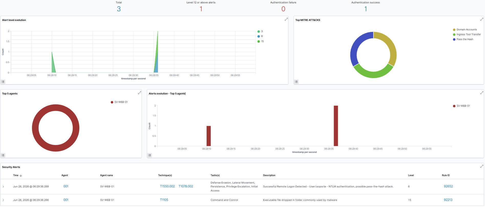
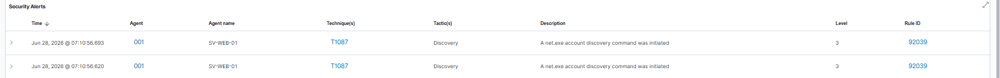
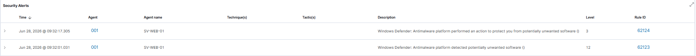

# Post-explotación en Windows vía WinRM — análisis de detección

Segundo escenario del [Home SOC Lab](../../). Continúa la cadena del [RDP Brute Force](../rdp-brute-force/): con las credenciales del usuario `soporte` ya comprometidas, este escenario analiza —desde la perspectiva defensiva— qué hace un atacante **después** del acceso inicial y qué de eso detecta (o no) el SIEM.

El atacante pivota a un canal más sigiloso (WinRM en lugar de RDP), enumera la cuenta e intenta escalar privilegios, todo desde la línea de comandos. El resultado: el endpoint se defendió (Microsoft Defender bloqueó el intento de escalación), pero el análisis expuso **gaps críticos de visibilidad en Wazuh**.

## El escenario, en una línea

Acceso vía evil-winrm con las credenciales robadas:

```bash
evil-winrm -i 192.168.20.10 -u soporte -p 'Password123'
```

Un matiz importante para no sobrevender el ataque: pasar de RDP a WinRM **cambia la huella forense, no los privilegios**. Es tradecraft, no escalación. Además, la cuenta `soporte` ya tenía acceso WinRM antes del ataque (un patrón realista de helpdesk sobre-permisionado), así que el pivote aprovecha un exceso de privilegios preexistente más que un logro del atacante.



## Detección al conectar — y un falso positivo instructivo

La sola conexión ya disparó una alerta nivel 15: evil-winrm deja utilidades en una carpeta temporal que coincide con un patrón de malware. Pero lo más interesante fue la regla **92652**, que etiquetó el logon como *posible Pass-the-Hash* — un **falso positivo**: la autenticación se hizo con la contraseña en texto plano, no con un hash.

¿Por qué la regla no puede distinguirlo? A nivel del Event ID 4624, un logon de red NTLM (LogonType 3) es **idéntico** se haya presentado una contraseña tipeada o un hash robado. El secreto que viajó no queda registrado en el log —solo el resultado de la autenticación. La regla aplica una heurística razonable ("logon NTLM remoto = posible PtH"), pero no tiene los datos para discriminar.

**Lección para análisis SOC real:** las etiquetas MITRE de las reglas son *hipótesis basadas en patrones*, no diagnósticos definitivos. Confirmarlas requiere contexto adicional (origen, historial, telemetría de credenciales).

## El hallazgo central — detectabilidad asimétrica

De cuatro comandos de enumeración ejecutados, Wazuh alertó sobre **solo dos**. La visibilidad depende de **dos compuertas independientes**: (1) ¿Sysmon genera un evento? —solo si la acción crea un proceso; los cmdlets nativos de PowerShell corren *in-process* y son invisibles— y (2) ¿Wazuh tiene una regla que lo eleve a alerta?

| Comando | ¿Sysmon lo ve? | ¿Wazuh alerta? |
|---|---|---|
| `Get-LocalUser` | No (cmdlet in-process) | No |
| `whoami /priv` | Sí (`whoami.exe` es proceso) | No (ninguna regla lo eleva) |
| `net user` / `net localgroup` | Sí (`net.exe` es proceso) | Sí (regla 92039) |

`net.exe` fue el único en cruzar **las dos** compuertas. Un atacante que entiende esto prefiere cmdlets nativos sobre binarios separados, precisamente para no generar procesos ni cruzar reglas. Detectar enumeración "silenciosa" exige cerrar el gap de la primera compuerta (PowerShell script-block logging), no solo escribir más reglas.



## Defensa en profundidad — AMSI corta lo que el AV de disco no ve

Sin privilegios escalables en la cuenta, el intento de escalación usó PowerUp.ps1 ejecutado **en memoria** (`IEX` + `DownloadString`) para no tocar disco y evadir el motor de archivos del antivirus. Funcionó contra el AV de disco, pero **no contra AMSI**, que inspecciona el contenido del script antes de que PowerShell lo parsee, sin importar el origen.

AMSI no bloqueó "un script sospechoso" genérico: identificó una técnica **específica** —`HackTool:PowerShell/EventVwrBypass`, un bypass de UAC (MITRE T1548.002)— y la puso en cuarentena. Un detalle forense revelador: el servidor Python en Kali registró **cuatro descargas** del script antes del bloqueo. Es decir, AMSI corta en el `IEX`, no en el `DownloadString`: la descarga ya viajó completa por la red antes de que se cortara la ejecución.



## El gap crítico — prevención sin detección

Acá está el problema de fondo: **Defender bloqueó el ataque, pero el SOC nunca se enteró.** El bloqueo se registró localmente (Event ID 1117 en el canal de Defender), pero la configuración por defecto del agente Wazuh no se suscribe a ese canal. Prevención sin detección es un muro ciego: un atacante puede iterar hasta evadir la firma sin que el equipo defensivo lo sepa.

El mismo patrón se repite en otras dos fuentes apagadas por defecto: PowerShell script-block logging y Sysmon EID 3 (conexiones de red salientes). El cierre técnico de estos tres gaps está documentado en [Wazuh Windows Telemetry Tuning](../Telemetry-tuneing/).

## RDP vs WinRM — la diferencia forense

WinRM es preferido por atacantes sigilosos no porque sea indetectable, sino porque su huella es **menos obvia** que RDP (sin sesión gráfica, sin procesos GUI). Aun así deja artefactos claros que un SOC con telemetría adecuada puede correlacionar:

| Aspecto | RDP (T1021.001) | WinRM (T1021.006) |
|---|---|---|
| Event 4624 — LogonType | 10 (RemoteInteractive) | 3 (Network) |
| Proceso testigo (Sysmon) | `rdpclip.exe`, `explorer.exe` | `wsmprovhost.exe` |
| Autenticación observada | Kerberos / SAM interactivo | NTLM |
| Riesgo de falso positivo de PtH | Bajo | **Alto** (NTLM remoto → sospecha automática) |

## Lecciones

1. **Migrar de canal no es escalación.** Cambiar de RDP a WinRM cambia la huella forense, no los privilegios. Un atacante con credenciales no-admin queda igual de limitado, solo más silencioso.
2. **Prevención sin detección es un muro ciego.** Defender bloqueó el ataque, pero sin recolectar su telemetría, el SOC no se entera. La prevención es necesaria pero no suficiente.
3. **Las etiquetas MITRE de reglas son hipótesis, no diagnósticos.** La regla 92652 marcó Pass-the-Hash cuando no lo había. El analista las usa como punto de partida investigativo, no como verdad final.
4. **Visibilidad ≠ existencia del evento.** El evento puede existir en el endpoint y nunca llegar al SIEM. Visibilidad = canal habilitado + regla que lo eleve.

---

*Parte del [Home SOC Lab](../../). Escenario previo: [RDP Brute Force](../rdp-brute-force/). Cierre de los gaps de visibilidad: [Wazuh Windows Telemetry Tuning](../../infrastructure/wazuh-windows-telemetry-tuning/).*
